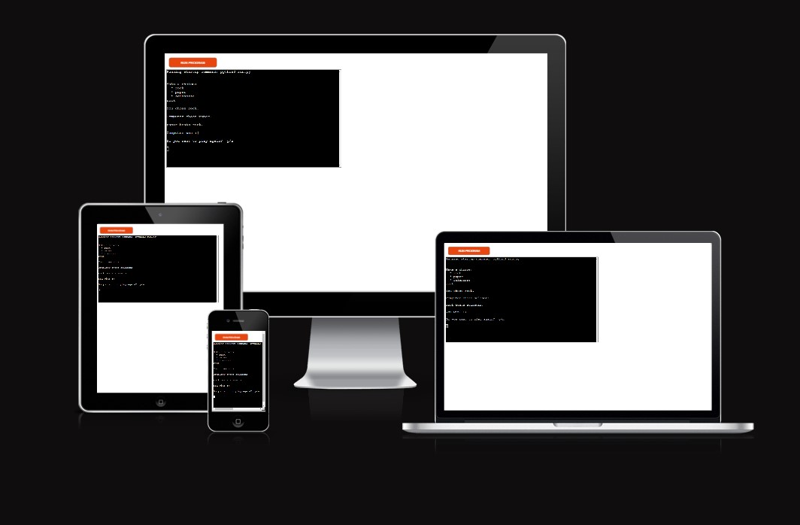
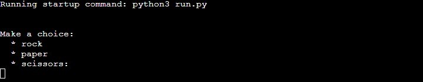
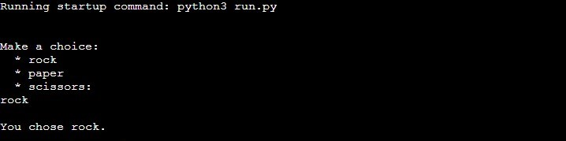
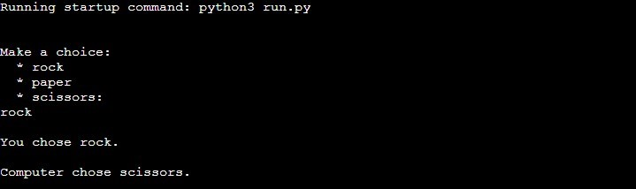
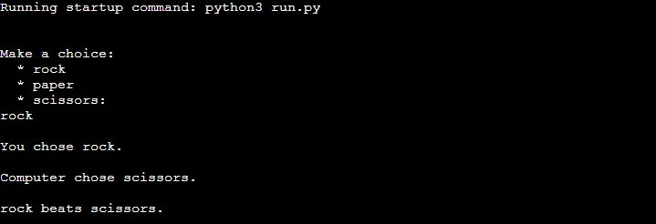
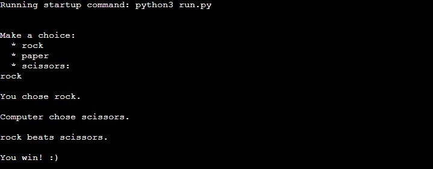
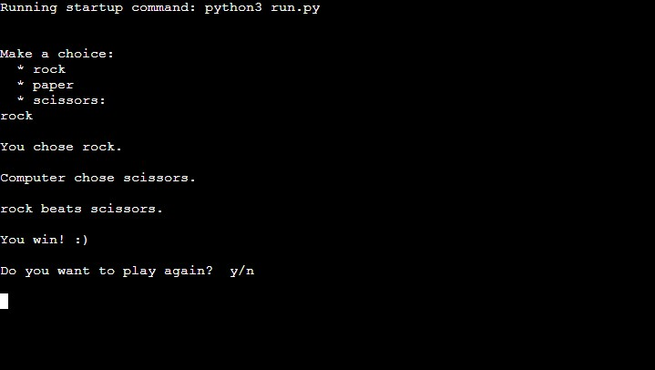
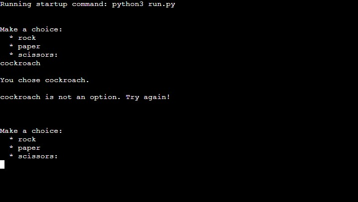
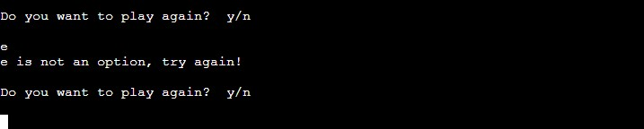

# Rock Paper scissors

Rock paper scissors is a game originating from china. It's is usualy played by hand between two people.
Rock smashes scissors, scissors cuts paper and paper covers rock.

It's a simple game any two people can play.
And if you dont have a friend to play with, this Program allows you to play against a cumputer.

[This is a link to the live version of my project](https://rock-paper-scissors-gurmali.herokuapp.com/)

## Features

The main feature is a working game that runs on an Heroku mock terminal.

### Features left to implement

 - A scoreboard for keeping track of how many times the user and the computer has won. Or as an alternative, showing the percentages of wins and losses.

## Game play

- The game starts by telling you to choose a hand.
- Rock, Paper or Scissors

- Lets say you chose Rock.
- The application tells the user the option they chose.

- Randomly selects and option for the computer.
- Tells the user what option the computer has chosen.

- Specifies which of the two options beats the other.

- And Tells the user who won.

- Finaly asking the user if they want to play again.

- Would the user want to play again, the game restarts.

### User errors

- If the user tries to choose anything other than the three options provided, they get an error message prompting them to try again.

- Similarly if the user does not write y or n when asked if they want to play again, the user gets an error message asking them to try again.

## Testing 

- I have manualy tested the features thuroughly throughout the building process of this application.
  
  - Users can not chose any other option than the three provided.
  - Users can use both upper and lower case when entering their option.
  - The Win/loss outcome of the game works as expected.
  - User gets asked after every game if they want to play again.
  - User can only choose Y or N (upper or lower case) when deciding if the want to play again.
  - The game restarts every time they choose to play again.
  - The application shuts down if user chooses not to play again.

- I have made sure everything works as expected in the heroku terminal.

### Validator Testing

- __PEP8__
  - I have ran the code through PEP8 validator and made sure no errors where returned.

### Bugs 

- No major bugs encoutered.

- No bugs left unfixed.

## Deployment

The project was deployed using Code Institute's mock terminal for Heroku.

- Steps taken for deployment.
    - Create a new Heroku app.
    - Add config vars. 
    - Add buildpacks: heroku/python and heroku/nodejs.
    - Link the Heroku app to the repository you want to deploy.
    - Click on Deploy.

## Credits

- I used different video and text tutorials to see how other people went about creating a text based rock, paper, scissors game.
- My mentor Sandeep for giving me pointers on how i can improove my application.
- Fellow student Erik Ljungkvist for helping me better understand Python.
- And a special thank you to Trevthedev777 for inspiring me to keep going when the going gets tough.